# 콘셉트 아트 갤러리

> 기본 표시는 2차 `anime-v2` 시안이다. 선이 명확한 2D 액션 애니메이션, 평면 색과 2단 셀 명암, 반복 작화가 가능한 단순한 재질을 기준으로 다시 제작했다. 기존 극사실풍 1차 이미지는 비교와 이력 보존을 위해 상위 폴더에 그대로 남겨 두었다.
>
> 이름, 성별, 세부 능력이 아직 결정되지 않은 인물은 정본 디자인이 아니며 해당 결정 후 수정할 수 있다.

## 1. 주인공과 늑대

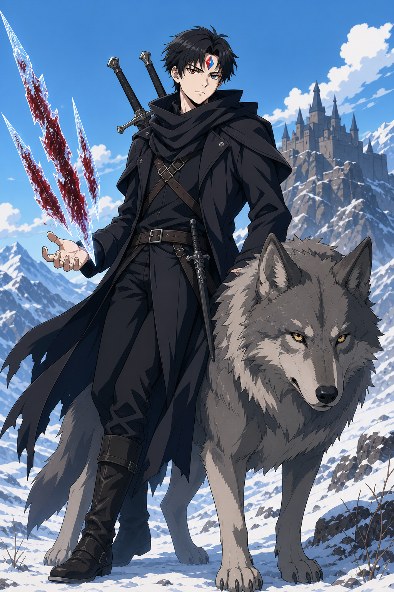

- 피와 얼음이 나뉜 이마의 소울스톤, 등에 멘 쌍검, 자연의 큰 늑대를 표현했다.

## 2. 적응 진화한 첫째 형

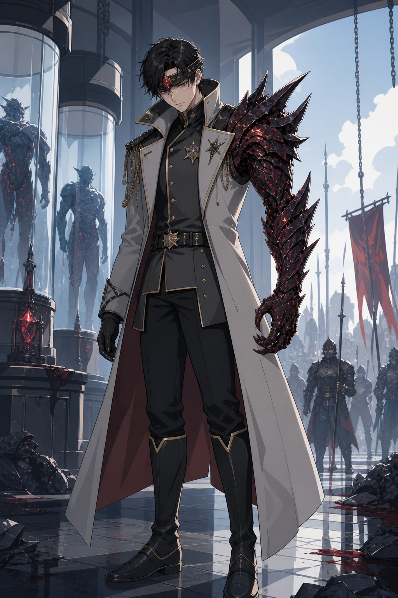

- 인간 장군의 외형과 한쪽에만 발현된 적응 진화, 실험 병기라는 배경을 표현했다.

## 3. 1대 원수와 빙관의 군주

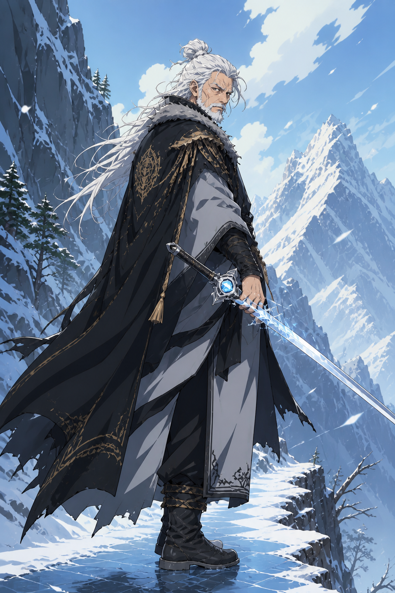

- 거대한 얼음 마법보다 절제된 얼음 보조와 완성된 검술을 중심에 뒀다.

## 4. 비극 이전의 가족

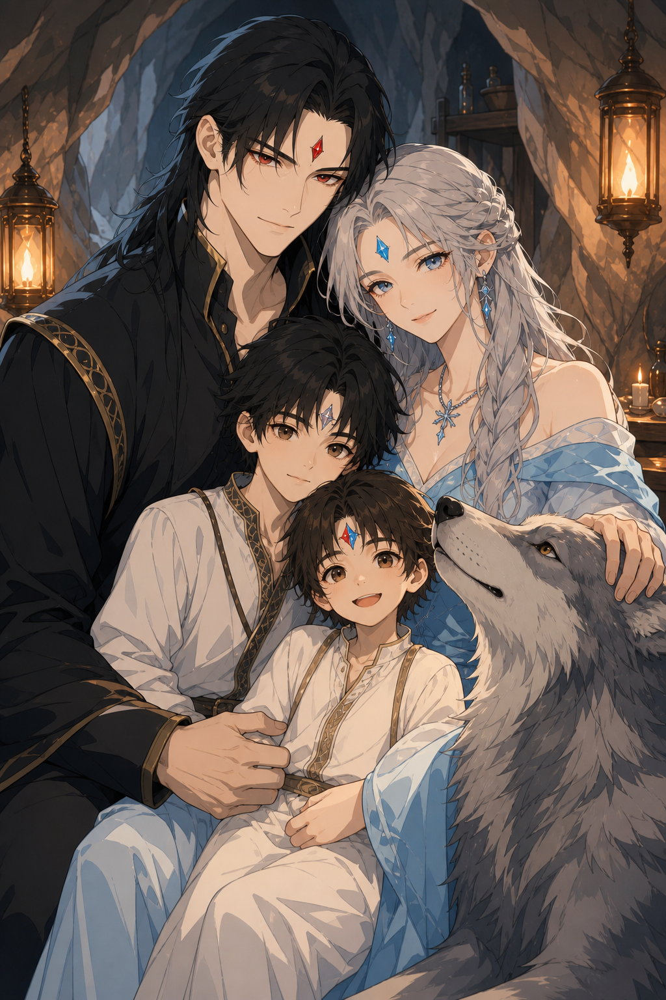

- 목걸이 속 가족사진의 기반 시안. 부모, 두 아들, 어머니와 함께 자란 늑대를 담았다.

## 5. 반인반수의 지도자와 2인자

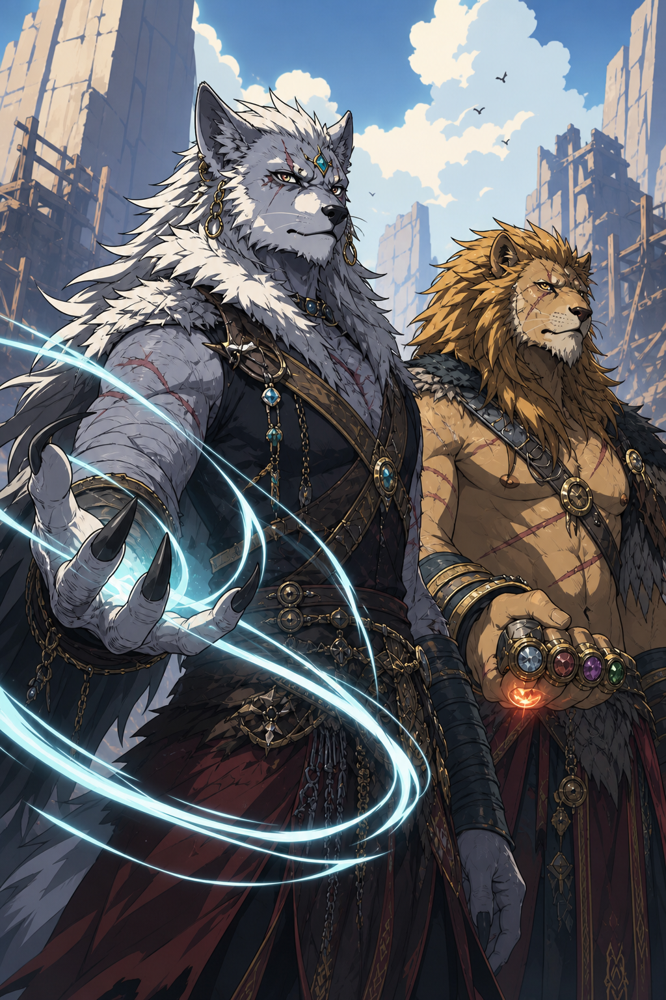

- 회백색 늑대인간이 유일한 최종 지도자이고 사자인간이 존중받는 공식 2인자라는 관계를 표현했다.
- 사자인간의 너클은 여러 선조의 돌을 품지만 한 순간에는 하나만 빛난다.

## 6. 트롤 대장

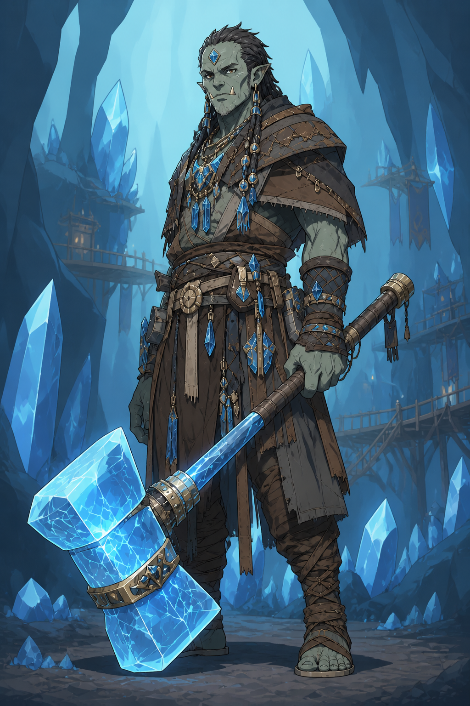

- 단순한 힘캐가 아니라 수정 광산과 선조의 기술을 지키는 지도자. 충격이 쌓일수록 무거워지는 수정 둔기를 들고 있다.

## 7. 골렘 대장

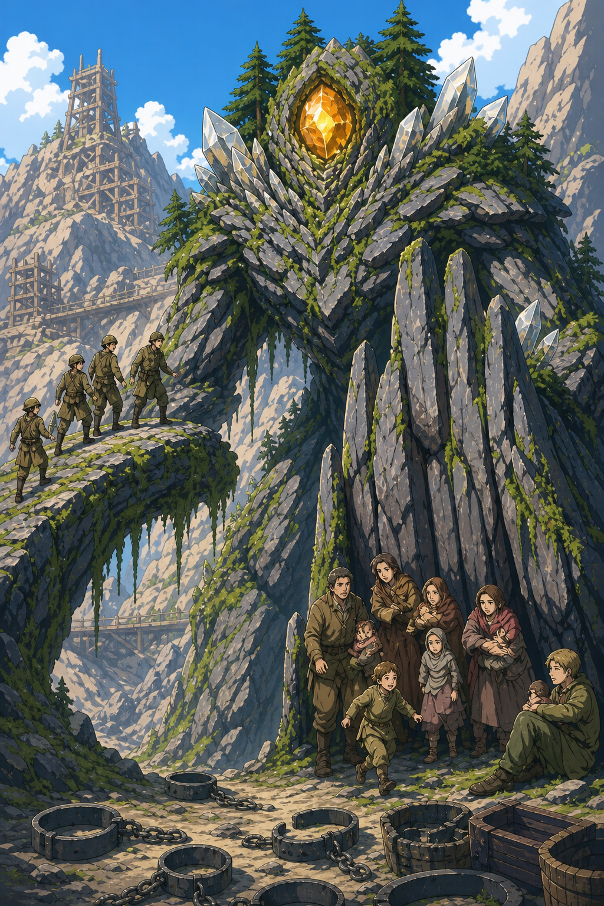

- 기계나 소환물이 아닌 자연 생명이며, 몸을 다리와 방벽으로 바꾸어 피난민을 돕는 역할을 표현했다.

## 8. 거미인간과 곤충연합

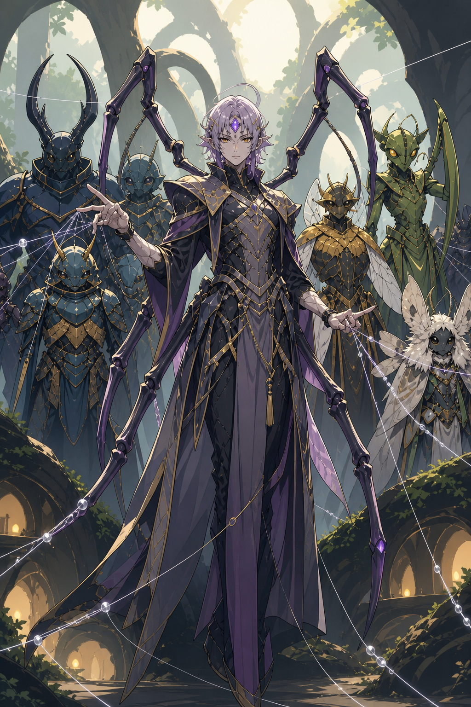

- 거미, 딱정벌레, 벌, 사마귀, 나방 공동체가 독립성을 유지한 채 통신망으로 연결된 연합이다.

## 9. 오크 검성 호위무사

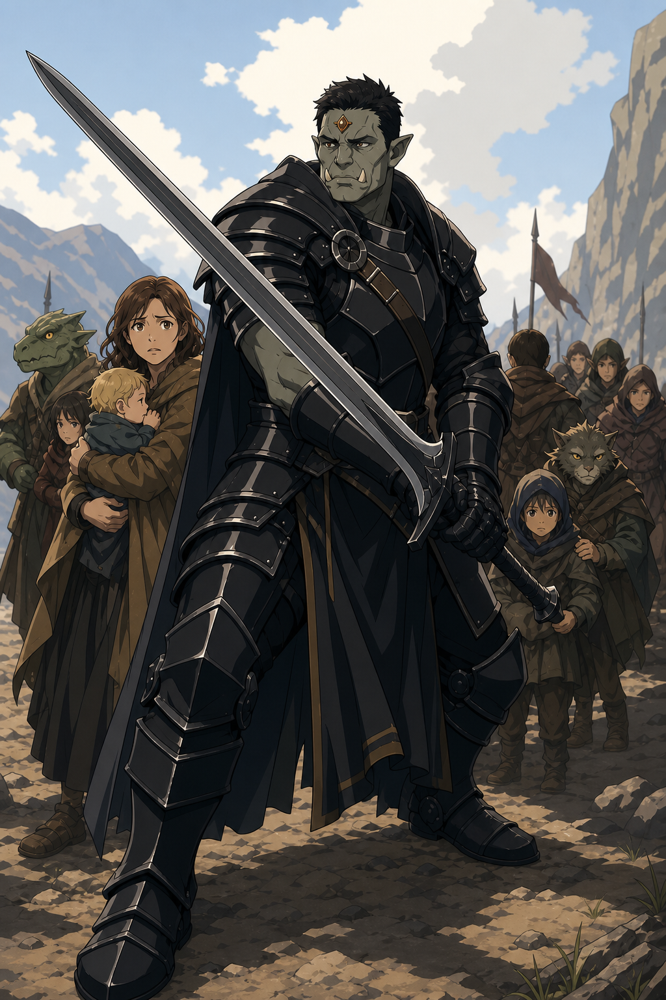

- 광전사가 아니라 정확한 거리와 최소 동작으로 난민과 주인공을 지키는 검객이다. 고유 능력은 아직 미정이다.

## 10. 반인반용 동료

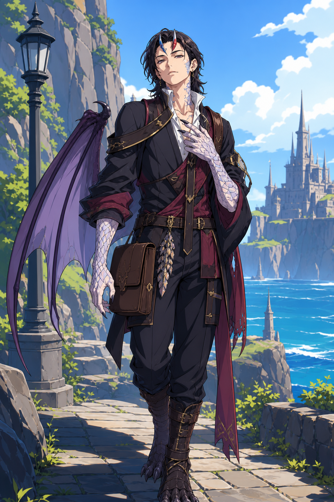

- 자신의 혼혈성을 긍정하는 인물의 초기 시안. 성별과 구체 능력은 아직 정본이 아니다.

## 11. 버림받은 인간 세 사람

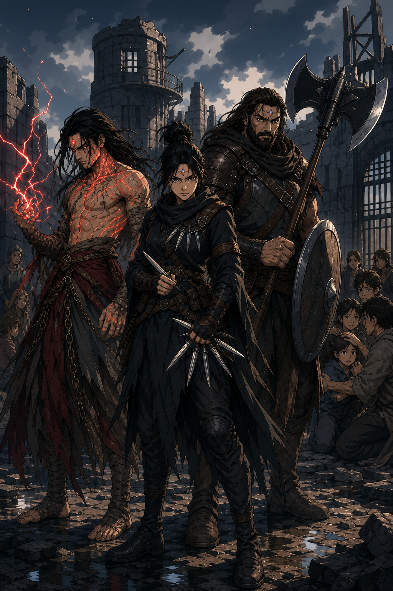

- 장로회 실험 생존자, 학살 명령을 거부한 정보 요원, 괴물 아이를 지킨 탈영병을 한 팀으로 표현했다.

## 12. 인간 연합 지휘부

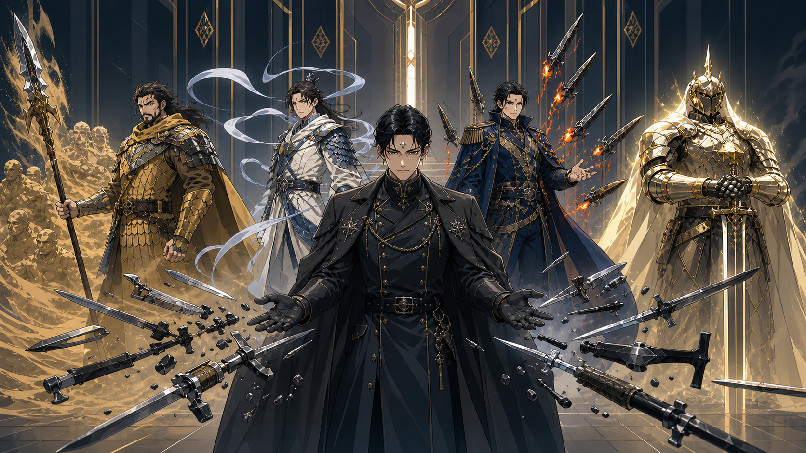

- 중앙의 회색 염동력 3대 원수와 모래·바람·강철·빛의 네 군 대장 시안이다.

## 13. 흑영대

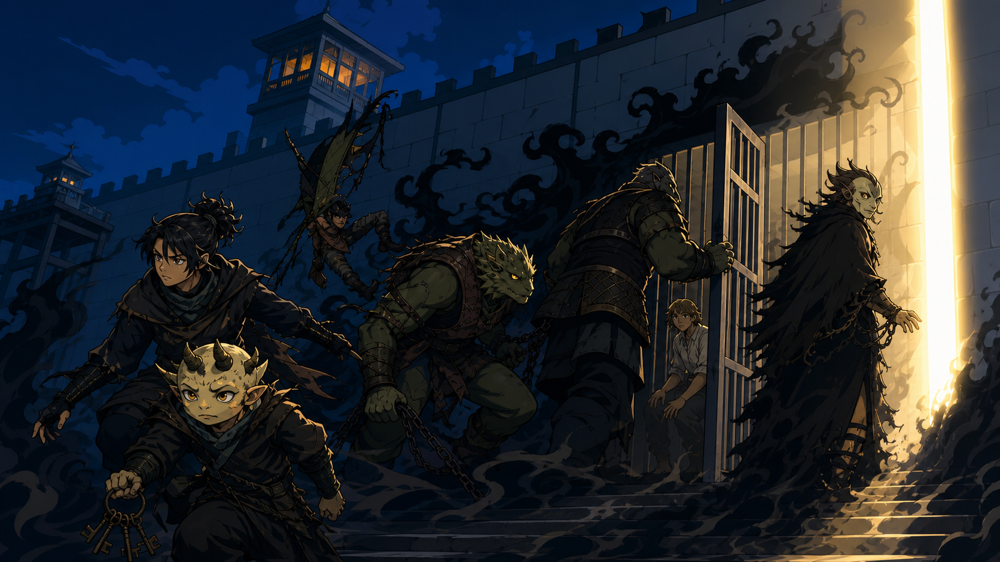

- 암살보다 수용소 개방과 구조를 수행하는 인간·괴물 혼성 특수부대다. 리더의 출신은 아직 미정이다.

## 14. 어인족과 하피족

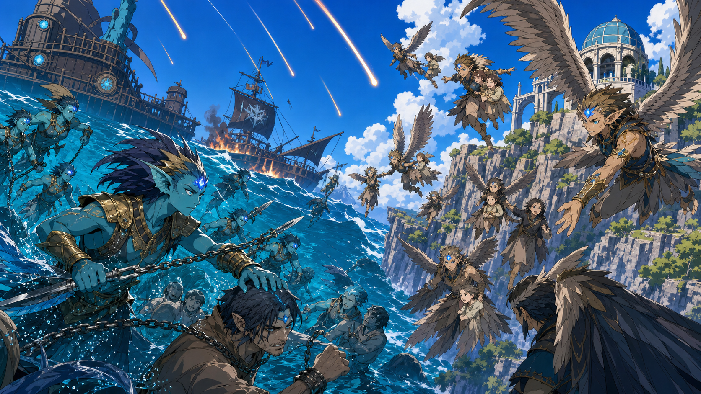

- 여행조가 아니라 바다와 하늘에서 각자의 고향을 지키며 최종전의 구조를 돕는 지역 동맹이다.

## 15. 살아난 성과 최종 구조전

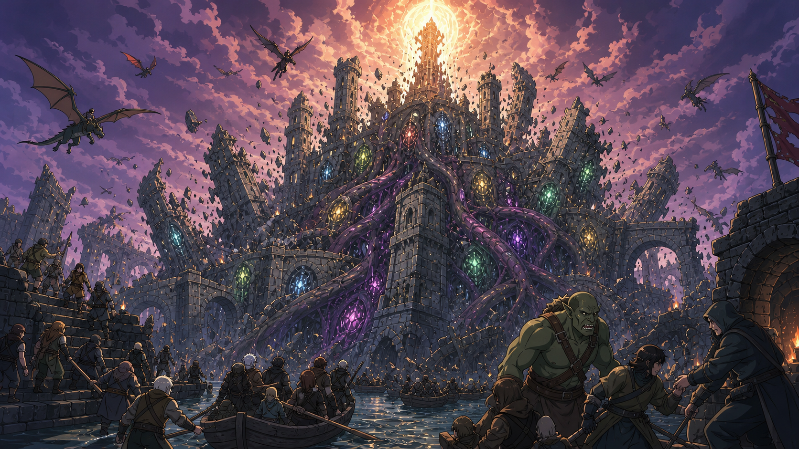

- 골렘이 아닌 새로운 생명. 중세 성 전체가 신경과 장기를 가진 육체가 되고, 생명이 죽으면서 성이 자연 붕괴한다.
- 마지막 전투의 중심을 처치가 아니라 인간과 괴물이 함께 수행하는 민간인 구조에 뒀다.

## 제작 기록

- 2차 공통 방향: 오리지널 2D 액션 애니메이션풍, 깨끗한 선화, 평면 색, 2단 셀 명암, 표정과 실루엣 우선, 단순화한 의상·재질·배경.
- 사용자 제공 예시는 선의 무게, 셀 채색과 형태 단순화만 참고했다. 예시 속 캐릭터, 얼굴, 헤어, 문양, 의상, 포즈, 구도와 글자는 사용하지 않았다.
- 기존 1차 사실풍 이미지는 파일명에 `anime-v2`가 없는 PNG로 보존했다.
- 이미지에는 로고, 워터마크, 작품명을 넣지 않았다.
- 재현과 수정용 요약 프롬프트는 [PROMPTS.md](PROMPTS.md)에 기록했다.
