# 통일 캐릭터 콘셉트 아트 — anime-v4

반인반수 지도자와 사자인간 2인자의 시안을 기준으로 전체 캐릭터의 그림체를 다시 맞춘 정본 후보 갤러리다.

## 공통 아트 방향

- 캐주얼한 현대 일본 TV 애니메이션풍의 선화와 셀 채색
- 극사실적 피부·금속·털 묘사를 피하고, 큰 색면과 읽기 쉬운 실루엣 사용
- 괴물 종족도 매력적인 인간형 얼굴을 기본으로 하되 귀, 꼬리, 송곳니, 피부, 결정, 비늘 등 종족 특징은 즉시 보이게 표현
- 주인공은 은백색 머리, 형은 강철빛 회색 머리와 은백색 끝부분
- 주인공 소울스톤은 옅은 청색 바탕 안에 붉은 결이 불규칙하게 흐르고 일부만 보랏빛으로 겹친다. 정확한 반반 분할은 금지한다.
- 이미지 안에 작품명, 대사, 로고, 워터마크를 넣지 않는다.

## 이미지

### 1. 주인공과 큰 늑대

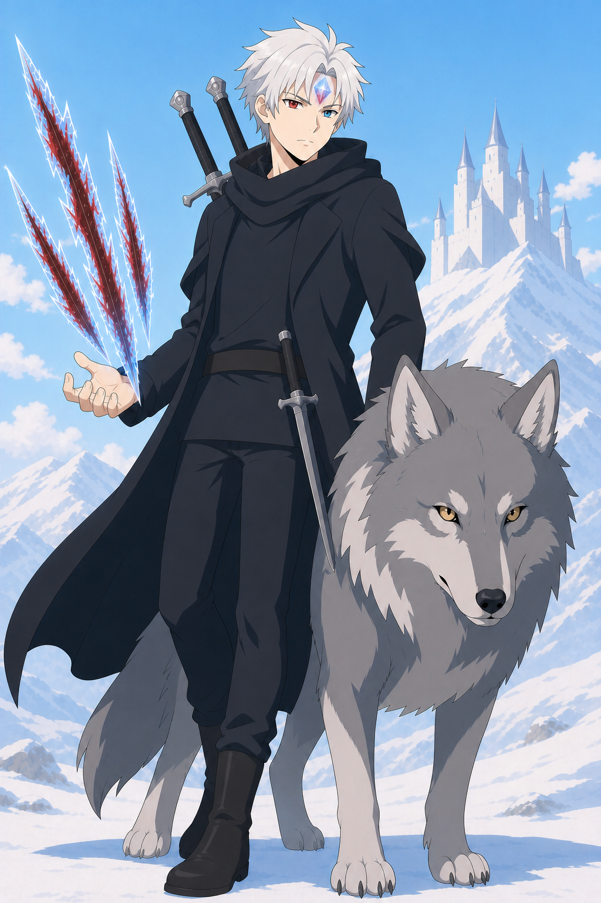

### 2. 적응 진화한 첫째 형

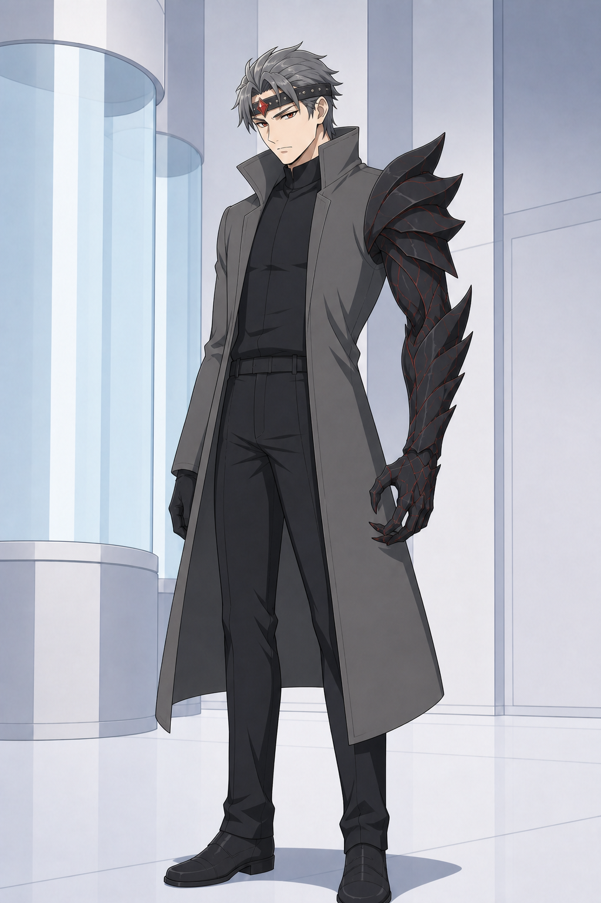

### 3. 1대 원수와 빙관의 군주

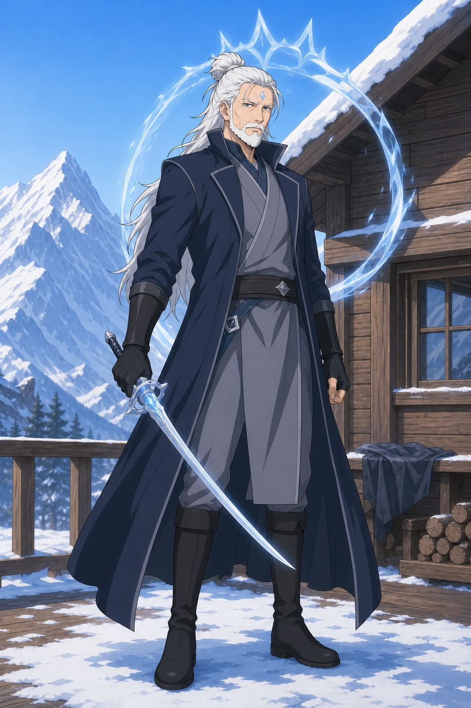

### 4. 비극 이전의 가족

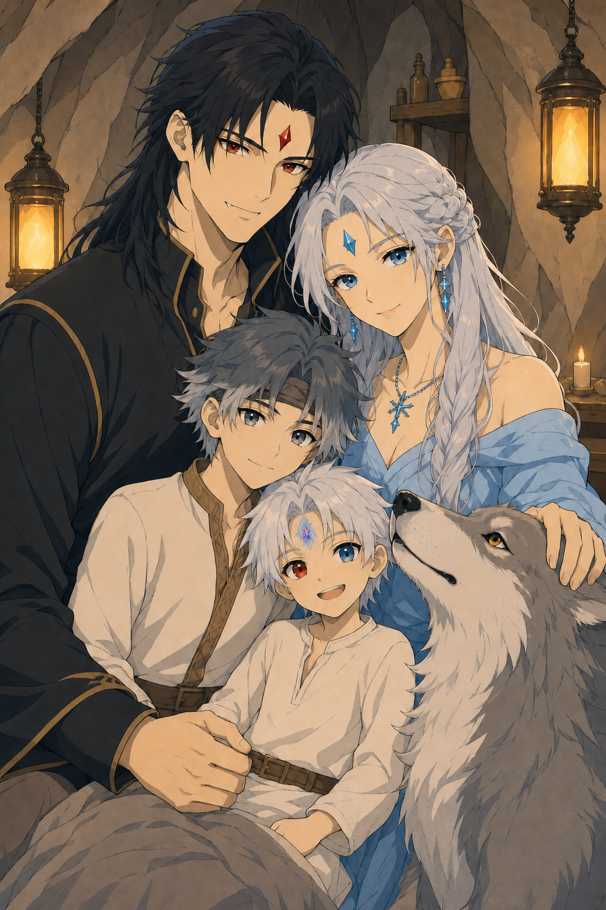

### 5. 반인반수 지도자와 사자인간 2인자

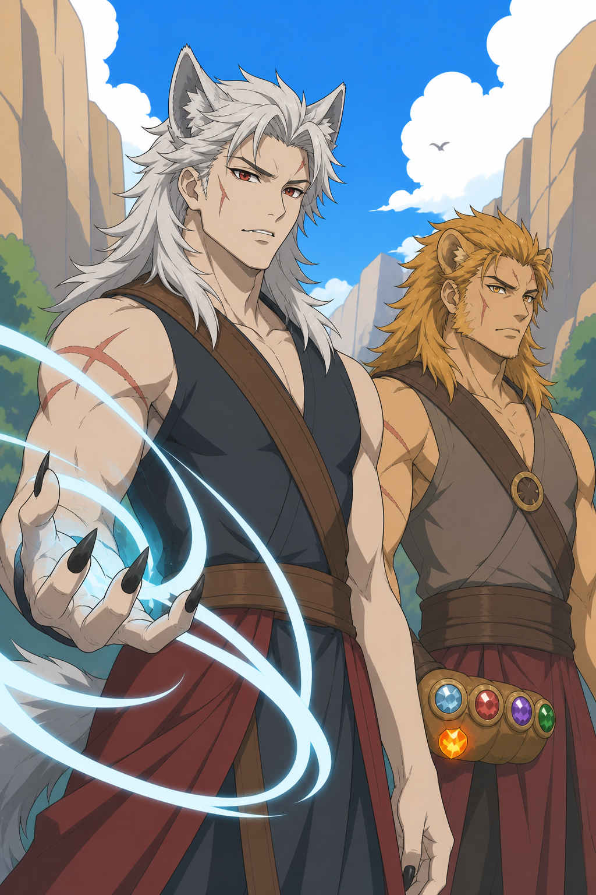

이 갤러리의 얼굴 비율, 선의 무게, 셀 채색, 종족 표현을 다른 캐릭터의 기준으로 삼는다.

### 6. 트롤 대장

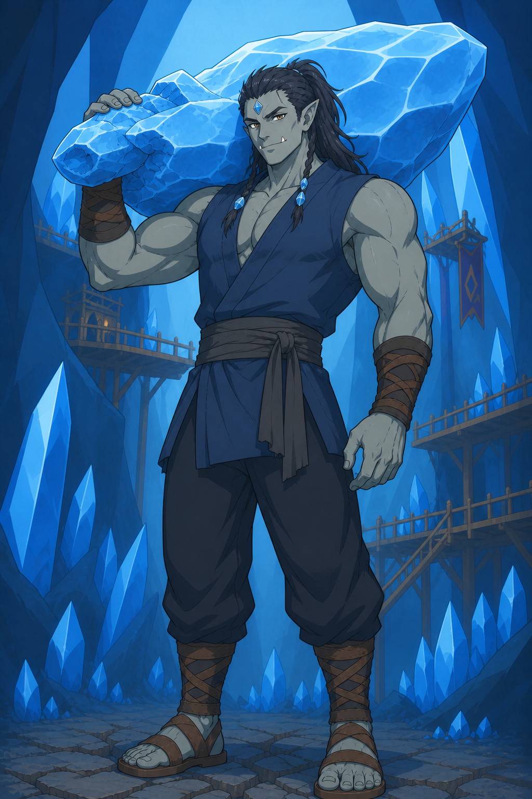

장발의 매력적인 지도자. 무기는 망치가 아니라 몸통만 한 비정형 하늘빛 수정 원석이다.

### 7. 골렘 대장

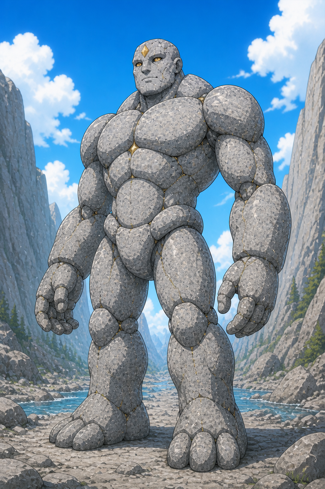

기존 5번 사암 수도자 정본. 화강암 후보 3안은 사용자 검토에서 폐기됐고, 현재는 돌 결합 방식과 실루엣을 분리한 신규 10안을 검토 중이다. 번호가 확정되기 전까지 이 파일을 보존한다.

### 8. 거미인간과 곤충연합

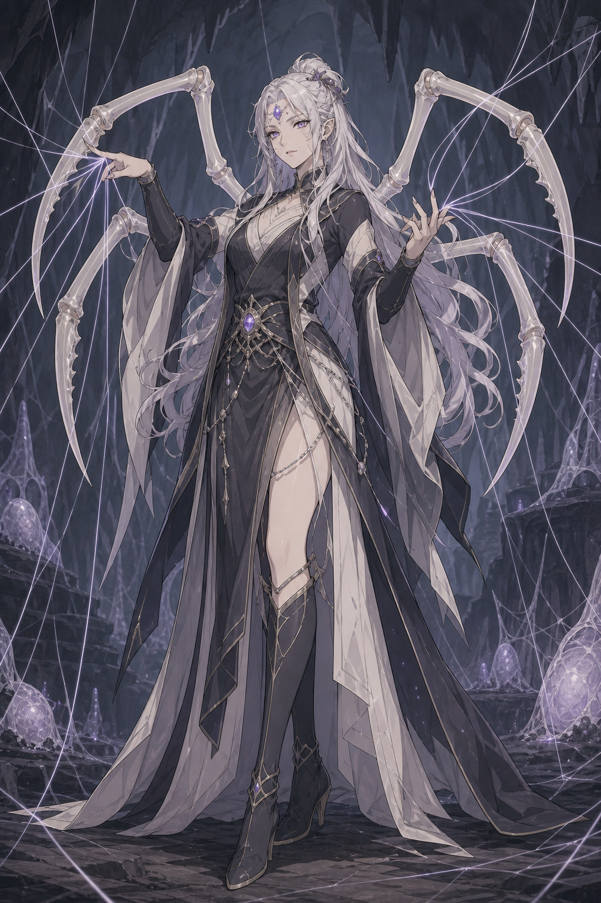

### 9. 오크 검성 호위무사

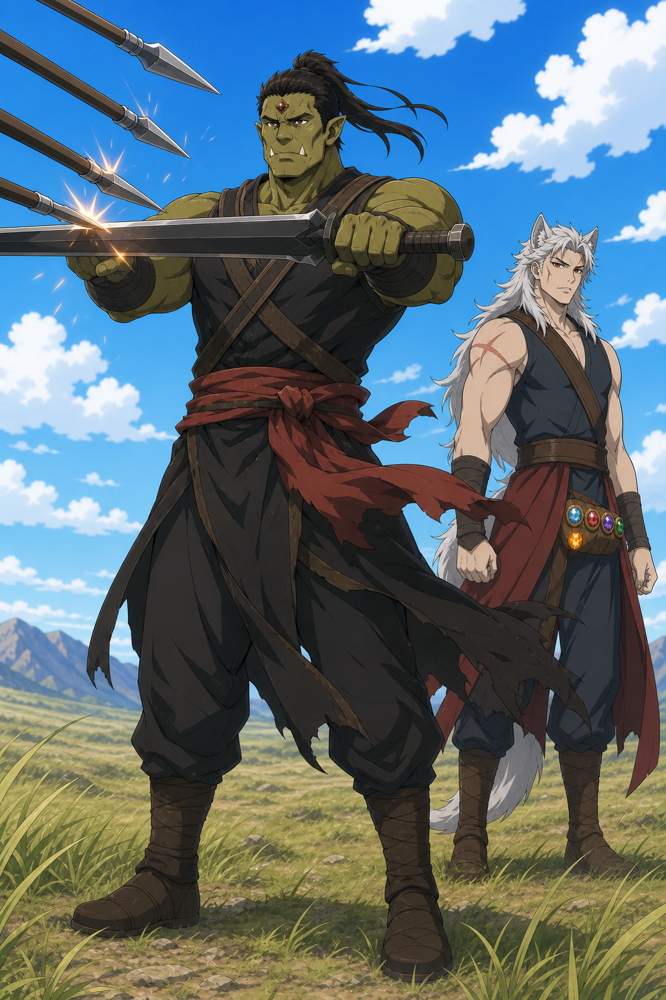

### 10. 반인반용 동료

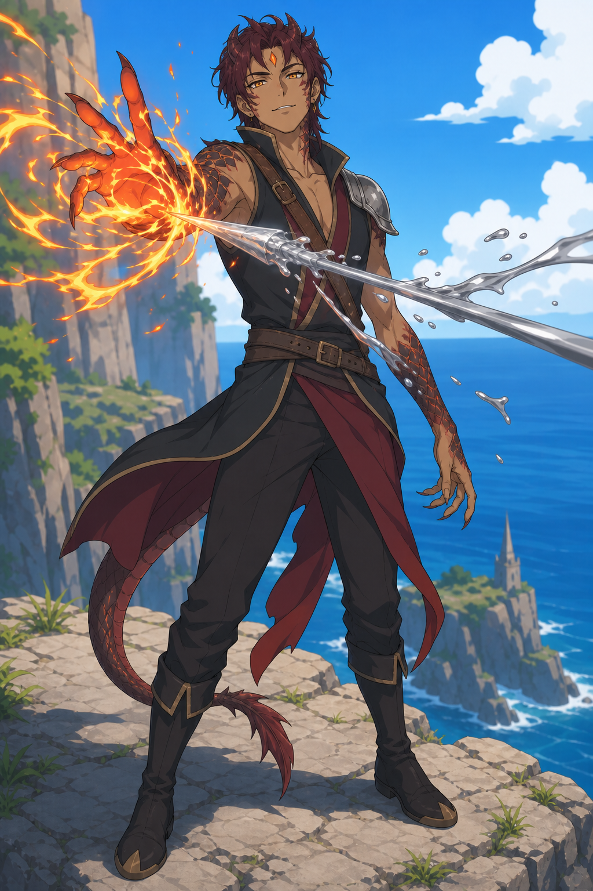

### 11. 버림받은 인간 세 사람

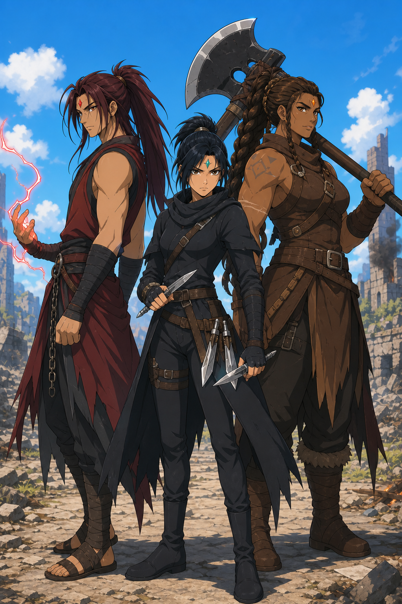

### 12. 인간 연합 지휘부

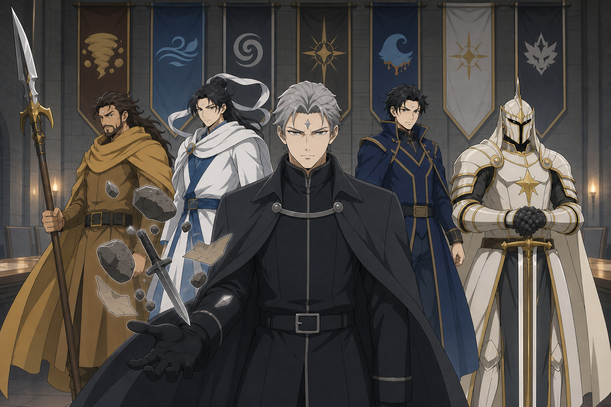

### 13. 흑영대

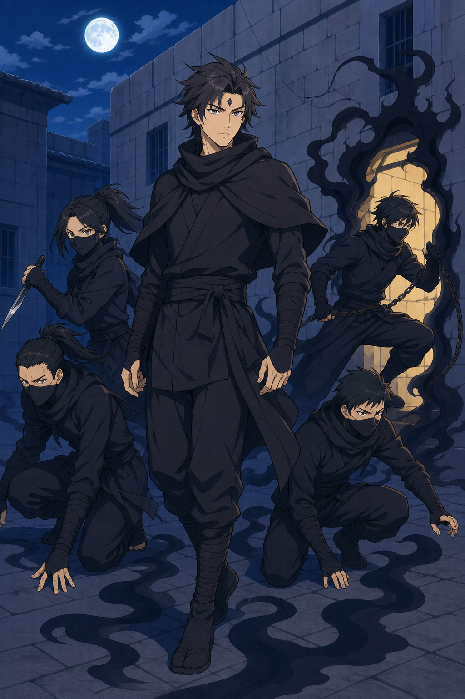

### 14. 어인족과 하피족

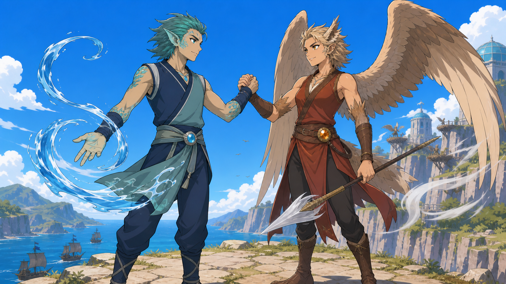

### 15. 살아난 성과 최종 구조전

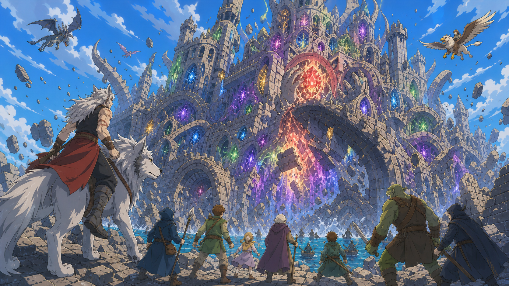

## 관련 자료

- [추가 중요 인물 18명](../important-characters-v1/README.md)
- [어인족 지도자 후보 10안과 선택 결과](../merfolk-candidates-v1/README.md)
- [화강암 골렘 신규 후보 10안](../golem-granite-candidates-v3/README.md)
- [폐기된 화강암 골렘 후보 3안](../golem-granite-candidates-v2/README.md)
- [시즌 1 전 60화 대표 이미지](../../episode-keyframes/season-01/README.md)
- [이미지 제작 지침과 재현 프롬프트](../ART-DIRECTION-AND-PROMPTS.md)
