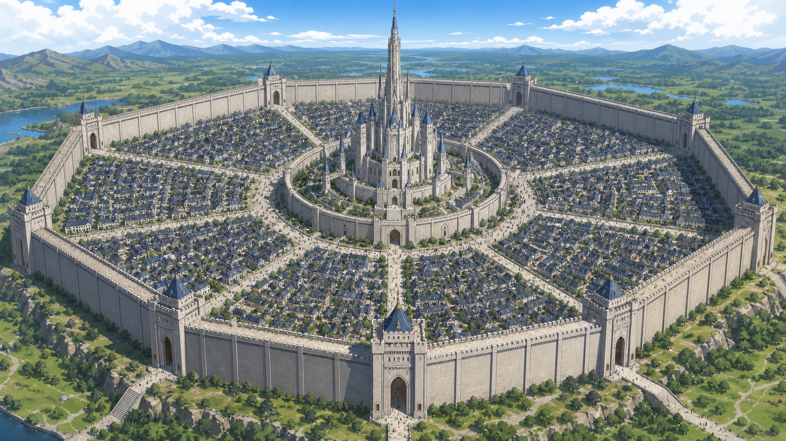

# 중요 지역 정본 콘셉트 아트

## 1. 인간 연합 중앙성

- 사용자가 선택한 **성 후보 03 칠각 일곱 구역 수도** 정본.
- 구름 가까이 솟은 초고층 외벽 안에 인간 시민의 마을과 일곱 가문의 구역이 나뉘어 있다.
- 중심에는 도시의 모든 건축물을 압도하는 장로회 중앙성채가 솟는다.
- 후반부에는 성 곳곳에 축적된 소울스톤과 인공 기관이 연결되어 `성생체`로 깨어난다.
